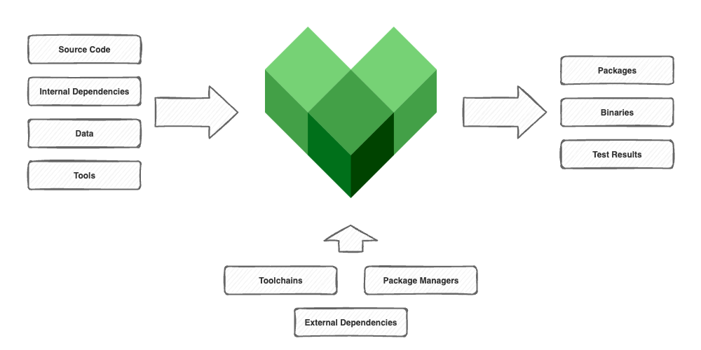

# What, Why, and When

Bazel is the open-sourced version of Google's internal build system, Blaze. It was first released in 2015 and received its first LTS version in 2021. Even though some of its features are still maturing, it's gaining a lot of traction from both big companies and the open-source community.

## What is Bazel?

In one sentence? Bazel is an artifact-based build system with a built-in dependency manager that, among other advantages, **can** deliver hermetic builds. I wrote "**can**" on purpose because Bazel only provides the means to achieve this, but ultimately, it all depends on how you set up your project.

To be honest, Bazel is a gigantic tool with thousands of options that can be overwhelming at times. However, after an initial learning curve, a few tips from colleagues, blogs, and open-source code, and, very importantly, focusing on implementing one feature at a time, you can really improve your codebase without much trouble.

## Why Bazel?

There are probably quite a lot of reasons why you should use Bazel. I'll share the ones that I get the most value from.

1. **Built-in dependency manager:** Bazel has so many great capabilities for handling both internal and external dependencies that it would require another article just to cover them. For now, I can say that it's great to let your build system handle all dependencies for you. As one of my colleagues likes to say, "Ideally, you just install Bazel on your machine, and everything else is automatically resolved and fetched."
2. **Fast:** While it does add a bit of overhead, Bazel is extremely fast. You can make use of parallelizable, incremental, and cacheable actions, which means faster builds. Additionally, Bazel offers ways to achieve remote caching and execution.
3. **Correct:** Use Bazel with a proper hermetic setup, and it will ensure that your builds are reliable and reproducible. No more "it works on my machine."
4. **Cross-platform:** Although Bazel was written for Linux, it also runs on Windows and macOS. Also, you can build project binaries for multiple platforms from the same machine. Segregating host and target configurations is a big deal.
5. **High-level build language:** With a human-readable language, Bazel makes it easy to describe targets and artifacts. You can expect to create `binaries`, `libraries`, and `tests`. Do you have a `cc_binary` that should rely on a `cc_library`? Don't worry, just add the library label to the list of dependencies of the binary, and Bazel will take care of the rest. Do you want to build? Issue a `bazel build` command. Do you need to test or measure coverage? Don't worry, just run `bazel test` or `bazel coverage`. Other fancy rules and commands are also available.
6. **Others:** Bazel scales. It really scales a lot. It supports multiple programming languages, so you don't need to support multiple build systems anymore. And finally, you can extend it, usually by writing Starlark code.

## When to use Bazel?

After all these reasons, you might be thinking that you *must* use Bazel, but is that really the case? When should you really use it? Well, it's complicated. Yes, unfortunately, even though I'm usually pro-Bazel, I can't recommend it for every use case.

As I said, Bazel provides you with the means to achieve something. The effort to properly set it up is usually low considering the benefits, although, again, depending on your codebase and which features you actually want to use from Bazel, it might require a lot of effort and maybe even a whole team to support this setup.

"Ok, you still haven't answered *when* one should use it." I know, and I probably can't give a definitive answer. What I can say is, try it out before doing a massive migration or starting a new project. Focus on the features that you think are most important, and get a feeling for what you would be able to achieve by setting realistic goals. From my experience, the more you use it, the easier and more straightforward it is to achieve great setups.

There are some scenarios where it is a bit more straightforward to choose Bazel over traditional build systems. For example:

- You have a dedicated build team that can lead the migration and support developers.
- Your codebase has multiple programming languages, and you need to support multiple build systems.
- Your builds are flaky, slow, and/or too big to be properly handled on local machines or even in the CI.
- You and/or your team want to try a really cool build system.

Also, remember, when deciding whether to adopt Bazel or not, it's also important to consider that it won't just be you or the responsible team dealing with it. Ideally, all developers will need to learn the basics, and that might not be well received by some, as they probably already have a lot on their plates.

## Final thoughts

Bazel is a great build system and can transform your development workflow by offering a lot of features almost out of the box. Just avoid false expectations, thinking that it will magically solve all your problems, and you will have a great experience with it, at least I do.

In the next articles, we'll try it out together.
